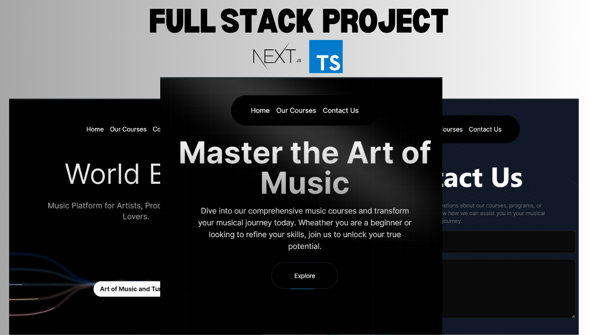

# AcerTunes

AcerTunes is a visually captivating music app developed using Acernity UI and TypeScript. The app focuses on providing a sleek and intuitive user interface to ensure a seamless experience for music enthusiasts.



## Features

- **Modern UI Design**: Leveraging Acernity UI for a visually appealing and user-friendly interface.
- **TypeScript**: Ensuring type safety and better code maintainability.
- **Responsive Design**: Optimized for different devices, providing a consistent experience across desktops, tablets, and smartphones.

## Getting Started

Follow these instructions to set up the project locally.

### Prerequisites

- Node.js (v14.x or later)
- npm (v6.x or later) or yarn (v1.22.x or later)

### Installation

1. Clone the repository:
   ```bash
   git clone https://github.com/akash202004/experiencing-nextjs-aceternity-ui
   cd acertunes
   ```
